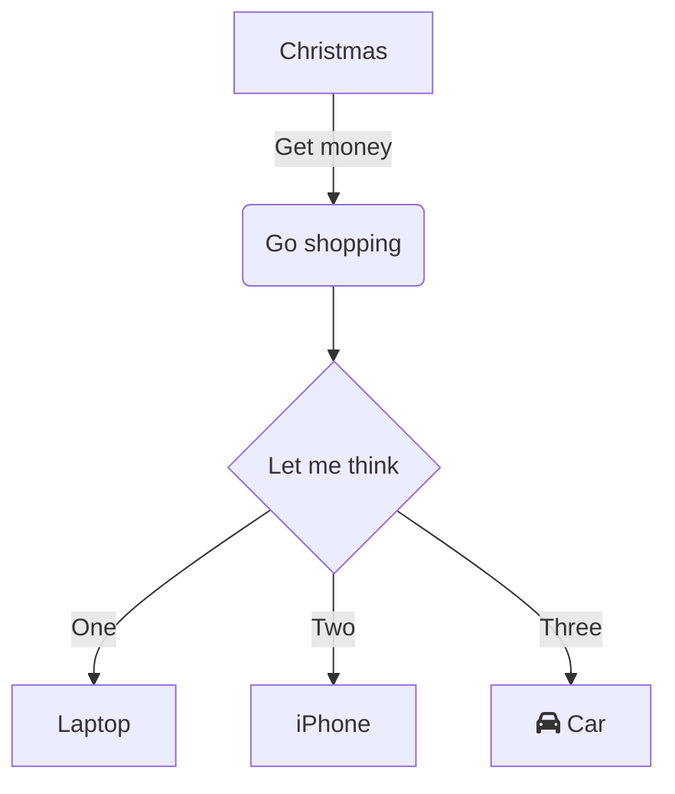

# Dice Game Pro

console app che:

- Crea una tabella che visualizza l'azione che si sta verificando, il punteggio del giocatore, il punteggio del PC e la situazione
- Chiede all'utente di premere un tasto per tirare i due dadi per il giocatore e per il PC
- La tabella si aggiorna e  e visualizza la situazione corrente
- Quando il punteggio di uno dei due giocatori arriva a 0 (o meno) la partita è finita  
- Il programma salva su di un file i 10 migliori scarti e a ogni fine partita ne stampa una tabella

**Obbiettivo:**

- Ordinare correttamente la lista e visualizzare i TOP 10 salvati

**Checklist**

- [ ] Creare array per contenere i risultati dei lanci
- [ ] Oggetto random con intervallo tra 1 e 6
- [ ] utilizzare un metodo per visualizzare il primo lancio
- [ ] Selezionare la logica migliore per permettere all'utente di scegliere quali dati tenere
- [ ] utilizzare un metodo per visualizzare il secondo lancio
- [ ] creare la logica di assegnazione del punteggio e visualizzarlo


**Codice:**
```csharp

```

**Mermaid**
