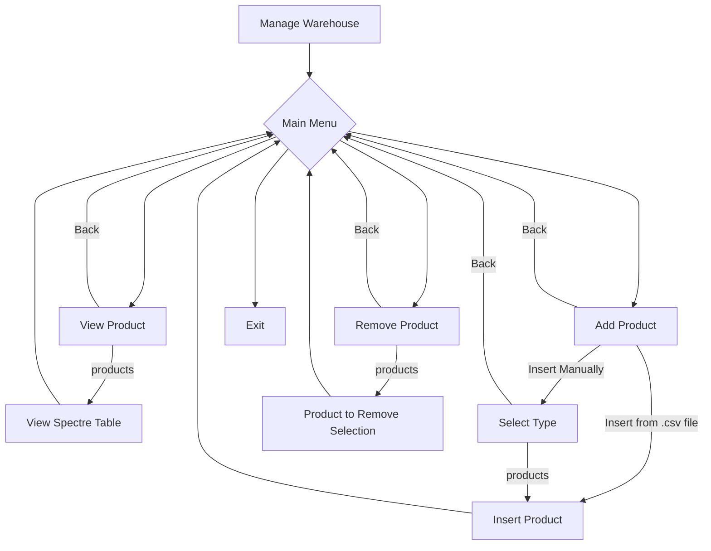

# Semplice applicazione console per la gestione di un magazzino
### in questo caso di un negozio di hardware informatico ma che potrà essere facilmente adattata a diversi ambiti.


## Mermaid Diagram



## Definizione delle funzionalità di base:

-   [x] L'applicazione dovrà essere in grado di gestire il magazzino di uno store (generico)
-   [x] Capacità di inserire e rimuovere prodotti manualmente
-   [x] Gestire la persistenza dei dati tramite cartelle e singoli file .json
-   [x] Possibilità di caricare prodotti tramite file .csv
-   [x] Gestione degli errori durante l'interazione con il filesystem
-   [x] I possibili utilizzatori saranno tutti i gestori di store (fisici/online)


## Pianificazione e Design dell'Architettura:

-   [x] Progetta l'interfaccia utente e l'esperienza utente (UI/UX).
        L'interfaccia sarà implementata usando Spectre Console sfruttando le funzionalità dei menù a scelta multipla, le tabelle e il testo colorato.


## TODO List:

-   [ ] Valutare una ridefinizione dei prodotti ad esempio usando le classi object o dynamic 
-   [ ] Implementare le funzioni di ordinamento grazie alla migliore accessibilità dei dati 
-   [ ] Implementare la funzione modifica
-   [ ] Considerare la possibilita di riprogettare l'oggetto prodotto -> da differenti tipi di oggetto all'oggetto singolo
-   [ ] Ottimizzazione delle funzioni

## Sviluppo dei Componenti:

-   [x] Sviluppa i modelli per la logica di business e l'accesso ai dati.
-   [x] Crea le viste e i view model/controller per la presentazione.
-   [x] Implementa la logica di controllo e l'integrazione tra i componenti.


## Test e Debugging:

-   [ ] Scrivi test unitari e test di integrazione.
-   [x] Esegui il debugging per individuare e risolvere i bug.

## Documentazione:

-   [x] Documenta il codice e l'architettura.


## Funzionamento dell'applicazione:

L'applicazione console funziona con un semplice menu a scelta multipla. L'utente naviga tramite l'utilizzo 
delle frecce direzionali. Dopo ogni selezione si entra nel sottomenu corrispondente dove nei campi "View Products" e "Remove Products"
si seleziona la tipologia di prodotto.
View Products legge dai files.json del prodotto selezionato e popola e visualizza una tabella Spectre.Console.
"Add Product" si dovrà selezionare se si vuole inserire il prodotto
manualmente o tramite file .csv.

I file.json dei prodotto sono strutturati in questo modo. Ogni file contiene un prodotto.

```json
{
  "property1": "string",
  "property2": 1,
  "property3": "string",
  "property4": 2
}
```

    Il nome del file è univoco e tiene conto delle cancellazioni.
    Se si sceglie di caricare da un file.csv il programma legge da una cartella tutti i file .csv e 
    propone all'utente da quale caricare (singolo o multiplo inserimento a seconda del file).

I file.cvs dei prodotto sono strutturati in questo modo con le prime due proprietà comuni a tutti
e le altre gestite con il prefisso "nomeProprieta:".

```csv
product,brand,prop1,prop2,prop3
cpu,intel,model:i7,mhz:3500
mother board,asus,model:xjz90,socket:m2
ram,vdata, size:4, type:ddr3, mhz:2500
video card,gigabyte,model:b650,ram:12
```

Finita l'operazione il file si potrà cancellare o archiviare.
In "Remove Product" prima, tramite una funzione, viene popolato un menu con il nome del file e le proprietà del prodotto (per facilitare l'individuazione dell'elemento desiderato). In base alla selezione il file corrispondente viene cancellato. 

Inizialmente l'applicazione gestisce 4 categorie di prodotti

CPU - VIDEO CARD - MOTHER BOARD - RAM   Ognuno dei quali con le seguenti proprietà:

```txt
CPU -> brand , model , mhz
MOTHER BOARD -> brand, model, socket
RAM -> brand, size, type, mhz
VIDEO CARD -> brand, model, ram
```
 


